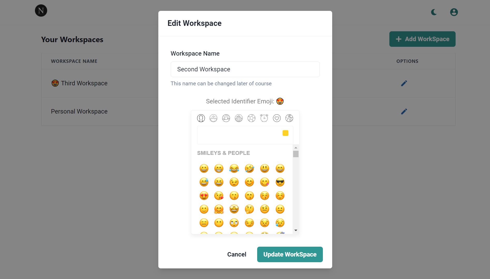
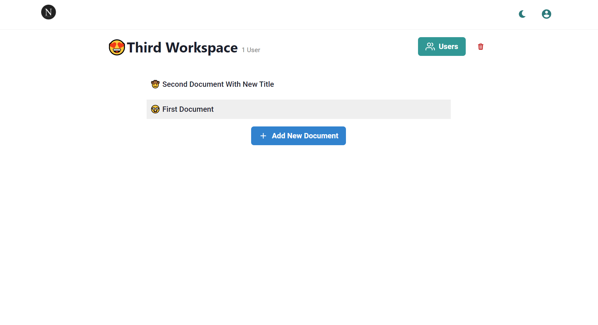
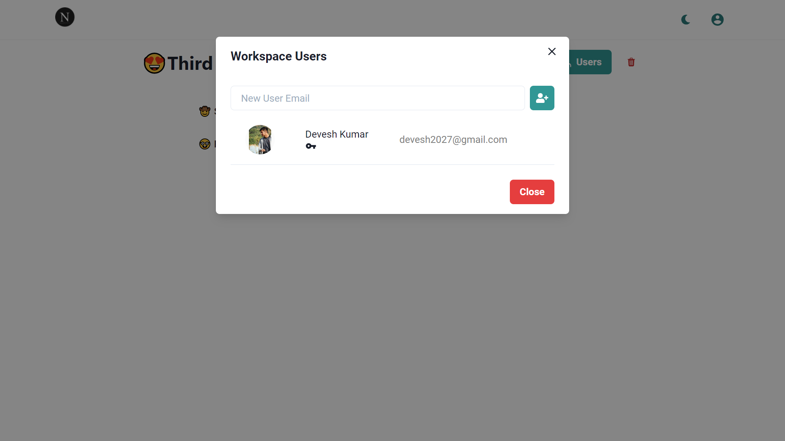
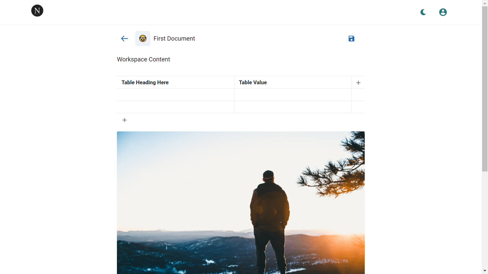
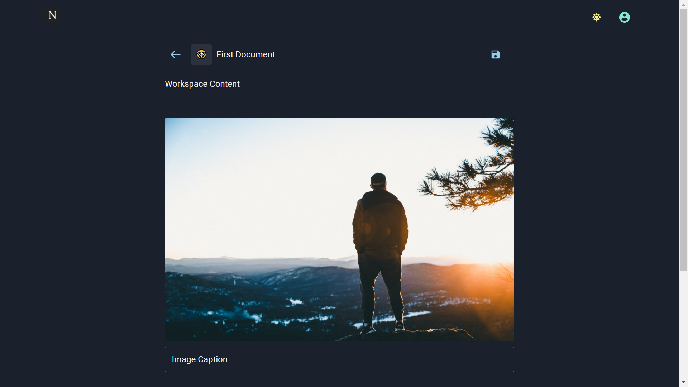

    

# Setting Up

Copy your Firebase project config from project settings, convert it to JSON and add it to `.env` as `REACT_APP_FIREBASE_CONFIG`.

### Features

The project is deeply inspired by Notion. Especially its Elegance and simplicity. Thanks to [Chakra UI](https://chakra-ui.com) for making styling so simple.

The feature list for this app includes:

- Sign In With Google and GitHub.
- Separated Team Workspaces with multiple users
- Dark Mode
- Nested Documents (Documents inside documents to structure information better)
- Block-Based Editing of Documents
- List of users involved in editing a document and a specific block of document is available.
- Reorderable documents
- Everything operates seamlessly on the frontend due to the power of Firebase.
- Secure, noone unauthorized will have access to your stuff since they are guarded by Firebase's security rules.
- Comments and document blocks linked to comments
- Comment Replies (**Coming Soon**)

##### Creating Workspace

##### Workspace

##### Add Users To Workspace

##### Create & Edit Documents

##### Dark Mode

### Contributions

The project is open-source and available for use on [Note It Down](https://noteitdown.vercel.app).

Contributions are welcome, please clone the repo, make the changes you need and open a merge-request.

### Bugs

Report bugs using Issues.
